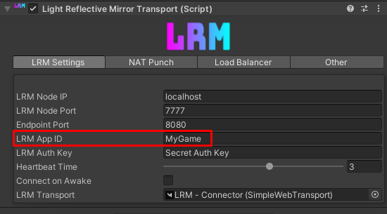
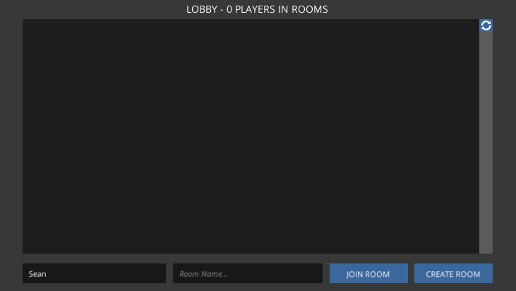
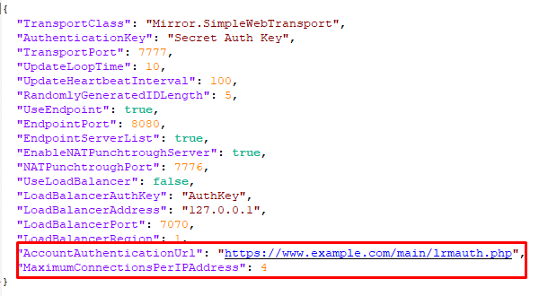
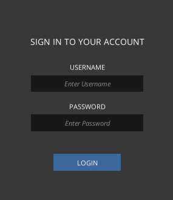
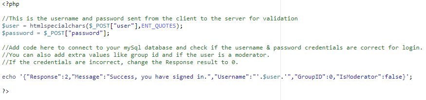

# Light Reflective Mirror - Extended

## What is this?
Light Reflective Mirror Extended is an enhanced version of the original "Light Reflective Mirror" project by Derek-R-S, adding new features, security and quality of life improvements.  For the full list of original features see; https://github.com/Derek-R-S/Light-Reflective-Mirror/blob/main/README.md

## New Features in this edition
* App ID support - Multiple games can be connected to the same relay server (via app id) and will have separate lobbies.
* Limit the amount of same-ip connections to the relay to prevent bot/spam attacks.
* New lobby system example.
* Optional server login credential system with php authentication.
* Optional server sided player names based on login credentials.

## App ID - Multiple games or version filtering

The new App ID field allows developers to separate lobbies based on a string (this could be a version number or even a separate game project you wish to relay on the same relay server).  Players will only recieve rooms based on matching App ID.

## Lobby System - New example 

I've included a new lobby system example for LRM with more features and polish. 
Developers can enable the requirement of server sided account login by toggling the "Use Account Authentication" boolean, [See image](Images/SAMPLE5.png).

## Maximum connections per IP address

I've added a new system that can limit the amount of connections from the same IP address to the relay server.  Useful to prevent mass spam bot attacks from the same address.  To change the maximum amount of connections from same IP addresses, change the "MaximumConnectionsPerIPAddress" field within the config file to whatever  number you wish.  Leave it as "0" for infinite.

Real world use example; after setting the maximum connections from the same IP address to 2, I opened my game window and connected fine.  I then opened a second game window and it also connected fine.  However, when I opened a third game window my connection was refused and I could not connect to the relay server on the third game window.

## Optional - Server sided account login authentication system
 

The relay server now has the option to allow connections via login authentication.

To use authentication via login, you simply add the url to the "AccountAuthenticationUrl" field within the config file.  If you do not wish to use this system, simply keep the field blank.
It will connect to your PHP URL and POST the username and password for a response.  You can then write code in your PHP file to connect to your mysql database.

The result string from your web PHP should be;
{"Response":0,"Message":"","Username":"","GroupID":0,"IsModerator":false}

I have attached a sample .php file to this repository with a simple example authentication (without using mySQL database);

`Response = ID of result, 0 means wrong username, 1 means wrong password (or banned), 2 means the credentials were correct and the username, groupID and moderator privilege is linked to the client id.`

`Message = A string also returned to the relay server for whatever extra data you'd like`

`Username = This string will be linked to the client ID as the username of the player`

`GroupID = An int value that will be linked to the client ID also, it can be referenced in-game, this could be for a membership system (ie. registered, premium, vip)`

`IsModerator = A bool that determines wither or not the client ID has moderator privileges for future moderator requests to the relay server (ie. kicking a player, closing a room)`

